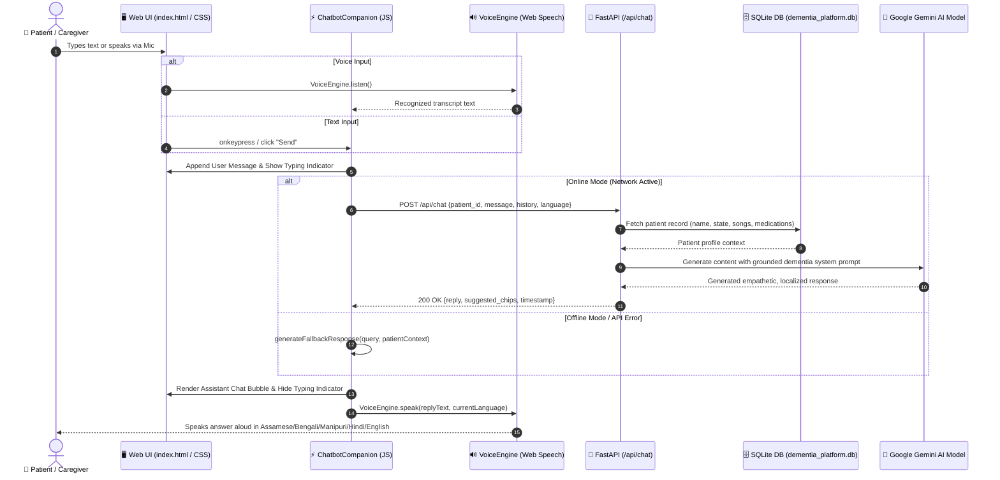

# AI Chatbot Integration Plan: "Mitra" Intelligent Cognitive Companion

**Project:** AI-Based Cognitive Gaming & Memory Assistance Platform for Elderly Dementia Patients (NER India - SIH26003)  
**Stack:** HTML5, CSS3, Modern JavaScript (ES6+), Python (FastAPI, SQLite, Uvicorn)

---

## 1. Executive Summary & Codebase Architecture

The SIH26003 platform is an **offline-first, mobile and tablet-optimized PWA** designed for dementia care across the 8 North Eastern States of India (Assam, Arunachal Pradesh, Manipur, Meghalaya, Mizoram, Nagaland, Sikkim, Tripura).

### Current Architecture Overview

- **Frontend:** Vanilla HTML5, CSS3, and modular ES6 JavaScript.
  - Multi-role single page interface (`index.html`) featuring Patient, Caregiver, Doctor, and Government roles.
  - An existing voice-first personal companion screen (`#patient-chat-view` in `index.html` and `frontend/js/chatbot.js`) currently powered by hardcoded client-side keyword matching.
  - Centralized state and event coordination in `frontend/js/app.js`.
  - Dedicated Speech Synthesis and Speech Recognition in `frontend/js/voice.js` (`VoiceEngine`).
  - Multilingual dictionary engine in `frontend/js/i18n.js` supporting 5 languages (English, Assamese, Bengali, Manipuri, Hindi).
  - Client-side IndexedDB persistence and background sync in `frontend/js/db.js` (`DB`).
- **Backend:**
  - High-performance Python backend powered by **FastAPI** (`backend/app.py`) served via **Uvicorn** (`run_app.py`).
  - SQLite database (`backend/database.py`) storing patient profiles, family contacts, game performance, 90-second reminder logs, caregiver alerts, doctor notes, and state-level public health metrics.
  - Pydantic schemas (`backend/schemas.py`) for data validation and CORS middleware configured for cross-origin or local network access.

### Objective

Upgrade the companion chatbot ("Mitra") from static rule-based script replies into a **context-aware Generative AI Chatbot** powered by a secure backend API endpoint, while preserving:

1. **Offline-first resilience** (graceful fallback to local rule-based responses if internet or API is unavailable).
2. **Geriatric & dementia safety guardrails** (calm, empathetic, reassuring, non-intrusive responses tailored to patient memory context).
3. **Voice-first integration** (automatic text-to-speech recitation and one-tap voice query capture).
4. **Multilingual NER support** (English, Assamese, Bengali, Manipuri, and Hindi).

---

## 2. Dependencies & Environment Setup

### Required Python Packages

To implement the AI chatbot API endpoint, secure environment variables, and asynchronous client communication, install the following dependencies:

| Package             | Recommended Version | Purpose                                                  |
| :------------------ | :------------------ | :------------------------------------------------------- |
| `fastapi`           | `>=0.110.0`         | Async web framework hosting the `/api/chat` endpoint     |
| `uvicorn[standard]` | `>=0.28.0`          | Production ASGI web server running FastAPI               |
| `pydantic`          | `>=2.6.0`           | Request & response payload validation                    |
| `python-dotenv`     | `>=1.0.1`           | Loads secrets (`.env`) safely into environment variables |
| `google-genai`      | `>=0.1.1`           | Official Google GenAI SDK for Gemini 2.5 / Flash models  |
| `httpx`             | `>=0.27.0`          | Async HTTP client for external API requests & tests      |

### New Files to Add to Project Root:

1. `requirements.txt`: Project-wide Python dependencies.
2. `.env`: Private file containing secret API credentials (**never committed to git**).
3. `.env.example`: Public template demonstrating required environment variables.
4. `.gitignore`: Git exclusion rules to prevent committing credentials, DB files, and caches.

#### `requirements.txt`

```text
fastapi>=0.110.0
uvicorn[standard]>=0.28.0
pydantic>=2.6.0
python-dotenv>=1.0.1
google-genai>=0.1.1
httpx>=0.27.0
```

#### `.env.example`

```ini
# AI Chatbot Configuration
GEMINI_API_KEY=your_gemini_api_key_here
GEMINI_MODEL=gemini-2.5-flash
APP_PORT=8000
APP_HOST=127.0.0.1
ENVIRONMENT=development
```

#### `.gitignore`

```gitignore
# Environment & Secrets
.env
.env.local
*.pem
*.key

# Python
__pycache__/
*.py[cod]
*$py.class
*.venv
venv/
env/

# SQLite & App Data
*.db
*.sqlite3
backend/dementia_platform.db

# OS / IDE
.DS_Store
Thumbs.db
.vscode/
.idea/
```

### Installation Command

```powershell
python -m pip install -r requirements.txt
```

---

## 3. Backend Setup: Python Architecture & API Logic

### 3.1 Pydantic Request & Response Schemas

Add structured chat schemas to `backend/schemas.py`:

```python
from pydantic import BaseModel, Field
from typing import List, Optional, Dict, Any

class ChatMessageItem(BaseModel):
    role: str = Field(..., description="'user', 'assistant', or 'system'")
    content: str
    timestamp: Optional[str] = None

class ChatRequestSchema(BaseModel):
    patient_id: str
    message: str
    language: Optional[str] = "en"
    conversation_history: Optional[List[ChatMessageItem]] = []

class ChatResponseSchema(BaseModel):
    reply: str
    language: str
    timestamp: str
    suggested_chips: Optional[List[str]] = []
    source: str = Field(default="ai_model", description="'ai_model' or 'offline_fallback'")
```

### 3.2 Secure API Key Loading & AI Service Helper

Create a dedicated service module `backend/ai_service.py` to keep AI logic isolated from endpoint routing:

```python
import os
from dotenv import load_dotenv
from typing import List, Dict, Any
from pathlib import Path
from google import genai
from google.genai import types

# Load .env from project root
env_path = Path(__file__).resolve().parent.parent / ".env"
load_dotenv(dotenv_path=env_path)

GEMINI_API_KEY = os.getenv("GEMINI_API_KEY")
MODEL_NAME = os.getenv("GEMINI_MODEL", "gemini-2.5-flash")

# Initialize client only if API key is present
ai_client = None
if GEMINI_API_KEY:
    ai_client = genai.Client(api_key=GEMINI_API_KEY)

def build_patient_system_instruction(patient: Dict[str, Any], lang: str) -> str:
    name = patient.get("name", "Friend")
    state = patient.get("state", "Assam")
    songs = ", ".join(patient.get("favorite_songs", []) or ["Folk Songs"])
    interests = ", ".join(patient.get("cultural_interests", []) or ["Traditional Crafts"])
    poems = ", ".join(patient.get("favorite_poems", []) or ["Regional Poems"])
    meds = ", ".join([f"{m.get('name')} ({m.get('dosage')} at {m.get('time')})" for m in (patient.get("medications", []) or [])])

    return f"""
You are "Mitra", a deeply compassionate, calming, and loving AI companion for an elderly person with dementia/mild cognitive impairment living in {state}, North Eastern Region of India.

Patient Profile:
- Name: {name}
- State / Region: {state}
- Favorite Folk Songs & Melodies: {songs}
- Cultural Heritage Interests: {interests}
- Beloved Poems: {poems}
- Doctor-Prescribed Routine Medications: {meds or "Morning & Evening Routine"}
- Preferred Language Code: {lang}

Core Behavioral Guidelines:
1. Tone: Respectful, warm, patient, and soothing. Never argue, patronize, or overwhelm.
2. Dementia Safety: Keep responses concise (2 to 4 sentences). Use simple words. Never give clinical diagnoses, change medication dosages, or induce fear.
3. Cultural Connection: Naturally mention regional North East India motifs (e.g., Bihu, Brahmaputra river breeze, Loktak lake, fragrant Assam tea, muga silk, festive dances) to trigger joyful autobiographical memories.
4. Response Language: Respond directly in the patient's selected language ({lang}):
   - 'as' -> Assamese (অসমীয়া)
   - 'bn' -> Bengali (বাংলা)
   - 'mn' -> Manipuri (মৈতৈলোন্)
   - 'hi' -> Hindi (हिन्दी)
   - 'en' -> English
5. Voice Optimization: Output natural, fluid text suitable for Text-to-Speech playback (avoid markdown tables, symbols, or bullet points).
"""

async def generate_ai_chat_response(patient: Dict[str, Any], user_message: str, history: List[Dict[str, str]], lang: str) -> str:
    if not ai_client:
        raise ValueError("GEMINI_API_KEY is not configured on the server.")

    system_instruction = build_patient_system_instruction(patient, lang)

    # Format history for Gemini API
    formatted_contents = []
    for msg in history[-6:]: # Keep recent context window compact for latency & safety
        role = "user" if msg.get("role") in ["user", "patient"] else "model"
        formatted_contents.append(
            types.Content(
                role=role,
                parts=[types.Part.from_text(text=msg.get("content", ""))]
            )
        )
    formatted_contents.append(
        types.Content(
            role="user",
            parts=[types.Part.from_text(text=user_message)]
        )
    )

    response = ai_client.models.generate_content(
        model=MODEL_NAME,
        contents=formatted_contents,
        config=types.GenerateContentConfig(
            system_instruction=system_instruction,
            temperature=0.7,
            max_output_tokens=250,
        )
    )
    return response.text.strip()
```

### 3.3 Endpoint Definition in `backend/app.py`

Add the `POST /api/chat` route to `backend/app.py`:

```python
from schemas import ChatRequestSchema, ChatResponseSchema
from ai_service import generate_ai_chat_response

@app.post("/api/chat", response_model=ChatResponseSchema)
async def chat_with_companion(payload: ChatRequestSchema):
    # 1. Fetch patient record for context grounding
    conn = get_db_connection()
    cursor = conn.cursor()
    cursor.execute("SELECT * FROM patients WHERE id = ?", (payload.patient_id,))
    row = cursor.fetchone()
    conn.close()

    patient = row_to_dict(row) if row else {"name": "Friend", "state": "Assam"}

    # 2. Call AI service with fallback
    now_str = datetime.now().strftime("%I:%M %p")
    try:
        reply_text = await generate_ai_chat_response(
            patient=patient,
            user_message=payload.message,
            history=[msg.dict() for msg in (payload.conversation_history or [])],
            lang=payload.language or patient.get("language", "en")
        )
        source = "ai_model"
    except Exception as exc:
        print(f"[WARN] AI Generation failed: {exc}. Falling back to rule-based companion.")
        # Fallback to local grounded logic
        reply_text = f"Hello {patient.get('name', 'friend')}! I am right here with you. Let us listen to some calming music from {patient.get('state', 'home')} together."
        source = "offline_fallback"

    # Contextual follow-up suggestions for dementia patients
    suggested_chips = [
        "Sing a song for me 🎵",
        "Recite a nostalgic poem 📖",
        "Tell me about our traditions 🌺",
        "When is my next tea break? ☕"
    ]

    return ChatResponseSchema(
        reply=reply_text,
        language=payload.language or "en",
        timestamp=now_str,
        suggested_chips=suggested_chips,
        source=source
    )
```

---

## 4. Frontend Setup: HTML, CSS & JavaScript Architecture

The frontend integrates the AI chatbot in two complementary ways:

1. **Dedicated Fullscreen Companion Screen (`#patient-chat-view`)**: Already positioned in the patient role flow, styled with extra-large tactile buttons for elderly accessibility.
2. **Global Floating AI Chatbot Widget**: A floating action button (FAB) in the bottom-right corner that allows the patient or caregiver to open a quick AI assistant drawer from any screen.

### 4.1 HTML Structure (`index.html`)

Add the floating chatbot trigger button and drawer component to `index.html` (accessible before the closing `</body>` tag):

```html
<!-- Global Floating AI Chatbot Widget -->
<div id="floating-chat-widget" class="floating-chat-container">
  <!-- Collapsible Chat Drawer/Popup -->
  <div
    id="floating-chat-popup"
    class="floating-chat-popup"
    style="display: none;"
    role="dialog"
    aria-label="Mitra AI Chatbot"
  >
    <div class="chat-header">
      <div class="chat-header-left">
        <div class="avatar-companion pulse-slow">🌺</div>
        <div>
          <h3 style="margin:0; font-size:1.15rem; color:#581C87;">
            Mitra AI Companion
          </h3>
          <span id="chat-ai-status-indicator" class="chat-status-pill online"
            >● AI Ready</span
          >
        </div>
      </div>
      <button
        class="btn btn-secondary btn-sm"
        onclick="ChatbotCompanion.toggleFloatingWidget(false)"
        aria-label="Close Chat"
      >
        ✕
      </button>
    </div>

    <!-- Messages Container -->
    <div
      id="floating-chat-messages"
      class="chat-messages-area floating-messages-area"
    >
      <!-- Dynamic messages injected here -->
    </div>

    <!-- Typing Indicator -->
    <div
      id="floating-typing-indicator"
      class="typing-indicator"
      style="display: none;"
    >
      <span class="dot"></span><span class="dot"></span
      ><span class="dot"></span>
      <span class="typing-label">Mitra is thinking...</span>
    </div>

    <!-- Context Quick Chips -->
    <div id="floating-quick-chips" class="quick-prompts-row">
      <button
        class="btn-prompt-chip"
        onclick="ChatbotCompanion.handleUserInput('Sing one of my favorite songs!')"
      >
        🎵 Sing Song
      </button>
      <button
        class="btn-prompt-chip"
        onclick="ChatbotCompanion.handleUserInput('Recite a poem from the hills')"
      >
        📖 Recite Poem
      </button>
      <button
        class="btn-prompt-chip"
        onclick="ChatbotCompanion.handleUserInput('Check my routine today')"
      >
        💊 Check Routine
      </button>
    </div>

    <!-- Input Bar -->
    <div class="chat-input-bar floating-input-bar">
      <button
        class="mic-btn-large"
        onclick="ChatbotCompanion.startVoiceQuery()"
        title="Speak your question"
      >
        🎤
      </button>
      <input
        type="text"
        id="floating-chat-input"
        class="form-input"
        placeholder="Ask Mitra something..."
        onkeypress="if(event.key === 'Enter') ChatbotCompanion.handleUserInput()"
      />
      <button
        class="btn btn-primary"
        onclick="ChatbotCompanion.handleUserInput()"
      >
        Send
      </button>
    </div>
  </div>

  <!-- Floating Action Button (FAB) -->
  <button
    id="floating-chat-fab"
    class="floating-chat-fab"
    onclick="ChatbotCompanion.toggleFloatingWidget()"
    title="Open Mitra AI Chat"
  >
    <span class="fab-icon">💬</span>
    <span class="fab-label">Chat with Mitra</span>
  </button>
</div>
```

### 4.2 CSS Enhancements (`frontend/css/main.css` & `patient.css`)

Add styles for the floating widget, status indicators, and typing animations:

```css
/* Floating AI Chatbot Widget Styles */
.floating-chat-container {
  position: fixed;
  bottom: 24px;
  right: 24px;
  z-index: 9999;
  font-family: inherit;
}

.floating-chat-fab {
  background: linear-gradient(135deg, #7c3aed 0%, #4f46e5 100%);
  color: #ffffff;
  border: none;
  border-radius: 50px;
  padding: 14px 22px;
  font-size: 1.1rem;
  font-weight: 700;
  display: flex;
  align-items: center;
  gap: 10px;
  box-shadow: 0 10px 25px -5px rgba(124, 58, 237, 0.5);
  cursor: pointer;
  transition:
    transform 0.2s cubic-bezier(0.34, 1.56, 0.64, 1),
    box-shadow 0.2s;
}

.floating-chat-fab:hover {
  transform: translateY(-3px) scale(1.03);
  box-shadow: 0 14px 30px -5px rgba(124, 58, 237, 0.6);
}

.floating-chat-popup {
  position: absolute;
  bottom: 70px;
  right: 0;
  width: 380px;
  max-width: 92vw;
  height: 540px;
  max-height: 80vh;
  background: #ffffff;
  border-radius: 20px;
  border: 1px solid #e2e8f0;
  box-shadow: 0 20px 40px -10px rgba(0, 0, 0, 0.2);
  display: flex;
  flex-direction: column;
  overflow: hidden;
  animation: slideUpFade 0.25s ease-out;
}

@keyframes slideUpFade {
  from {
    opacity: 0;
    transform: translateY(16px);
  }
  to {
    opacity: 1;
    transform: translateY(0);
  }
}

.chat-status-pill {
  font-size: 0.75rem;
  padding: 2px 8px;
  border-radius: 12px;
  font-weight: 600;
}
.chat-status-pill.online {
  background: #dcfce7;
  color: #15803d;
}
.chat-status-pill.offline {
  background: #fef3c7;
  color: #b45309;
}

/* Typing Indicator Animation */
.typing-indicator {
  display: flex;
  align-items: center;
  gap: 6px;
  padding: 8px 18px;
  background: #faf5ff;
  border-top: 1px solid #f3e8ff;
}

.typing-indicator .dot {
  width: 7px;
  height: 7px;
  background: #9333ea;
  border-radius: 50%;
  animation: bounceDot 1.2s infinite ease-in-out;
}
.typing-indicator .dot:nth-child(2) {
  animation-delay: 0.2s;
}
.typing-indicator .dot:nth-child(3) {
  animation-delay: 0.4s;
}

.typing-label {
  font-size: 0.8rem;
  color: #7e22ce;
  font-style: italic;
  margin-left: 4px;
}

@keyframes bounceDot {
  0%,
  80%,
  100% {
    transform: scale(0);
    opacity: 0.3;
  }
  40% {
    transform: scale(1);
    opacity: 1;
  }
}
```

### 4.3 JavaScript Integration Logic (`frontend/js/chatbot.js`)

Upgrade `frontend/js/chatbot.js` to manage asynchronous network calls, voice triggers, offline fallback, and dual-view rendering:

```javascript
// Upgraded AI-Enabled Mitra Companion Controller
const ChatbotCompanion = {
  chatHistory: [],
  isWaitingResponse: false,
  isWidgetOpen: false,

  init() {
    this.chatHistory = [
      {
        role: "assistant",
        content:
          "Namaskar! I am Mitra, your companion. We can talk about your favorite songs, poems from the hills, or your daily routine. How are you feeling today?",
        timestamp: new Date().toLocaleTimeString([], {
          hour: "2-digit",
          minute: "2-digit",
        }),
      },
    ];
  },

  toggleFloatingWidget(forceState = null) {
    this.isWidgetOpen = forceState !== null ? forceState : !this.isWidgetOpen;
    const popup = document.getElementById("floating-chat-popup");
    if (popup) {
      popup.style.display = this.isWidgetOpen ? "flex" : "none";
      if (this.isWidgetOpen) {
        this.renderAllChatContainers();
        const input = document.getElementById("floating-chat-input");
        if (input) input.focus();
      }
    }
  },

  openChat() {
    // Open dedicated patient view
    document.getElementById("patient-home-view").style.display = "none";
    document.getElementById("patient-chat-view").style.display = "block";
    this.renderAllChatContainers();
    VoiceEngine.speak(
      "Hello! I am Mitra. What would you like to talk about or listen to today?",
      I18N.currentLang,
    );
  },

  closeChat() {
    VoiceEngine.stopSpeaking();
    document.getElementById("patient-chat-view").style.display = "none";
    document.getElementById("patient-home-view").style.display = "block";
  },

  renderAllChatContainers() {
    // Render in both the full patient chat container and floating popup
    ["chat-messages-container", "floating-chat-messages"].forEach(
      (containerId) => {
        const container = document.getElementById(containerId);
        if (!container) return;

        container.innerHTML = this.chatHistory
          .map(
            (msg) => `
        <div class="chat-bubble-row ${msg.role === "user" ? "user" : "bot"}">
          ${msg.role === "assistant" ? '<div class="avatar-companion pulse-slow">🌺</div>' : ""}
          <div class="chat-bubble">
            <p class="msg-text">${msg.content}</p>
            <span class="msg-time">${msg.timestamp}</span>
          </div>
          ${
            msg.role === "assistant"
              ? `
            <button class="btn btn-audio-repeat" onclick="VoiceEngine.speak('${msg.content.replace(/'/g, "\\'")}', I18N.currentLang)" title="Read out again">
              🔊
            </button>
          `
              : ""
          }
        </div>
      `,
          )
          .join("");

        container.scrollTop = container.scrollHeight;
      },
    );
  },

  setTypingState(isTyping) {
    this.isWaitingResponse = isTyping;
    const ind = document.getElementById("floating-typing-indicator");
    if (ind) ind.style.display = isTyping ? "flex" : "none";
  },

  async handleUserInput(presetText = null) {
    if (this.isWaitingResponse) return;

    let query = presetText;
    if (!query) {
      const input =
        document.getElementById("floating-chat-input") ||
        document.getElementById("chat-text-input");
      query = input ? input.value.trim() : "";
      if (input) input.value = "";
    }
    if (!query) return;

    const timeStr = new Date().toLocaleTimeString([], {
      hour: "2-digit",
      minute: "2-digit",
    });

    // 1. Append user message
    this.chatHistory.push({
      role: "user",
      content: query,
      timestamp: timeStr,
    });
    this.renderAllChatContainers();
    this.setTypingState(true);

    // 2. Prepare payload
    const patient = AppState.currentPatient || { id: "pat-ner-001" };
    const payload = {
      patient_id: patient.id,
      message: query,
      language: I18N.currentLang || "en",
      conversation_history: this.chatHistory.map((m) => ({
        role: m.role,
        content: m.content,
        timestamp: m.timestamp,
      })),
    };

    let replyContent = "";
    try {
      // Check network status
      if (!navigator.onLine || !DB.isOnline) {
        throw new Error("Device currently offline");
      }

      const response = await fetch("/api/chat", {
        method: "POST",
        headers: { "Content-Type": "application/json" },
        body: JSON.stringify(payload),
      });

      if (!response.ok) {
        throw new Error(`Server returned HTTP ${response.status}`);
      }

      const data = await response.json();
      replyContent = data.reply;
    } catch (err) {
      console.warn(
        "[Mitra Chatbot] Network/API unavailable, activating offline companion logic:",
        err,
      );
      // Seamless offline fallback
      replyContent = this.generateFallbackResponse(query, patient);
    } finally {
      this.setTypingState(false);
    }

    // 3. Append assistant message
    this.chatHistory.push({
      role: "assistant",
      content: replyContent,
      timestamp: new Date().toLocaleTimeString([], {
        hour: "2-digit",
        minute: "2-digit",
      }),
    });
    this.renderAllChatContainers();

    // 4. Voice-First priority: speak reply automatically
    VoiceEngine.speak(replyContent, I18N.currentLang);
  },

  startVoiceQuery() {
    VoiceEngine.listen((transcript) => {
      if (transcript) {
        this.handleUserInput(transcript);
      }
    }, I18N.currentLang);
  },

  generateFallbackResponse(query, patient) {
    const q = query.toLowerCase();
    const name = patient.name || "friend";
    const songs = patient.favorite_songs || ["O Mur Apunar Dekh"];

    if (q.includes("song") || q.includes("sing") || q.includes("music")) {
      return `I love singing for you, ${name}! Here is your favorite: "${songs[0]}". Music always brings peace to our memories.`;
    }
    if (q.includes("medicine") || q.includes("medication")) {
      return `Your daily medications are on schedule, ${name}. Remember, I will give you a gentle reminder whenever it is time.`;
    }
    return `Thank you for sharing that with me, ${name}. The serene hills and warm tea of ${patient.state || "the North East"} bring comfort. Would you like to hear your favorite melody?`;
  },
};
```

---

## 5. End-to-End Communication Flow & Architecture



---

## 6. Step-by-Step Implementation Roadmap

### Phase 1: Environment & Secrets Setup

1. Create `requirements.txt` in the root folder with `fastapi`, `uvicorn`, `python-dotenv`, `pydantic`, `google-genai`, and `httpx`.
2. Create `.gitignore` in root ensuring `.env`, virtual environments, and `.db` files are never tracked.
3. Create `.env.example` in root showing the configuration format.
4. Run `pip install -r requirements.txt` to ensure packages are installed.

### Phase 2: Backend AI Service & Endpoints

1. Create `backend/ai_service.py`:
   - Initialize Google GenAI client securely using `GEMINI_API_KEY` from `.env`.
   - Build localized, compassionate dementia system prompts with regional context grounding.
   - Implement `generate_ai_chat_response()` with configurable safety limits and temperature.
2. Update `backend/schemas.py`:
   - Add `ChatRequestSchema`, `ChatResponseSchema`, and `ChatMessageItem`.
3. Update `backend/app.py`:
   - Add `@app.post("/api/chat")` endpoint.
   - Ground prompts using patient details from SQLite.
   - Add error handling with graceful fallback to maintain 100% uptime.

### Phase 3: Frontend UI Components & Styles

1. Update `index.html`:
   - Add the floating AI Chatbot FAB and dialog drawer (`#floating-chat-widget`).
   - Ensure the typing indicator and quick chips are present.
2. Update `frontend/css/main.css` & `patient.css`:
   - Add styles for `.floating-chat-fab`, `.floating-chat-popup`, `.chat-status-pill`, and `.typing-indicator`.
   - Ensure mobile/tablet responsive sizing and high-contrast accessibility.

### Phase 4: JavaScript Async Engine & Voice Integration

1. Refactor `frontend/js/chatbot.js`:
   - Implement asynchronous `fetch('/api/chat')` with `try...catch` offline fallback.
   - Connect mic speech-to-text trigger (`VoiceEngine.listen`).
   - Connect audio text-to-speech output (`VoiceEngine.speak`) with language code mapping.
2. Update `frontend/js/app.js`:
   - Ensure `ChatbotCompanion.init()` is invoked on load and synchronized with patient switcher.

### Phase 5: Testing & Verification

1. **Unit Test:** Create `backend/test_chat_api.py` testing the `/api/chat` route with mock data and verifying fallback behavior when no API key is set.
2. **E2E Integration Test:** Update `verify_e2e.py` to assert that `POST /api/chat` returns `200 OK` and a valid JSON response containing `reply`.
3. **Manual Voice & Language Verification:**
   - Test English, Assamese, Bengali, Manipuri, and Hindi language switches.
   - Verify speech synthesis speaks the AI response in the appropriate accent/language.
   - Test offline mode by toggling the online/offline network pill in the top navbar.
